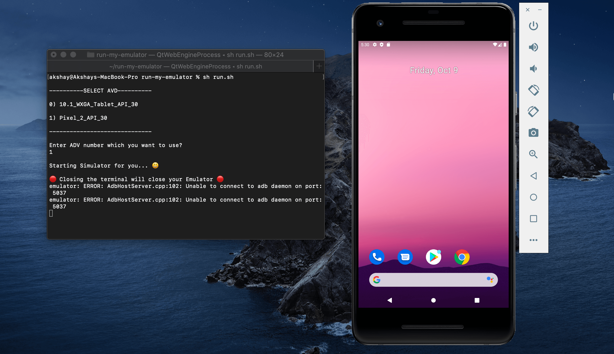

# Simple command line utility to run Android emulator

#### Running the script

    sh run.sh

Use [gitbash](https://git-scm.com/download/win) to execute bash file on windows   
OR
`bash run.sh //inside command prompt`


Make sure you have environment variable set up before using above command

<hr/>

#### Configure the ANDROID_HOME environment variable (MacOS)

Add the following lines to your  `$HOME/.bash_profile`  or  `$HOME/.bashrc`  (if you are using  `zsh`  then  `~/.zprofile`  or  `~/.zshrc`) config file:

```sh
export ANDROID_HOME=$HOME/Library/Android/sdk
export PATH=$PATH:$ANDROID_HOME/emulator
export PATH=$PATH:$ANDROID_HOME/tools
export PATH=$PATH:$ANDROID_HOME/tools/bin
export PATH=$PATH:$ANDROID_HOME/platform-tools

```

#### Configure the ANDROID_HOME environment variable (Windows)
Launch Command Prompt and add these directories to your environment **PATH** variable with the following commands:

    PATH = %PATH%;C:\Users\User\AppData\Local\Android\Sdk\platform-tools 
    PATH= %PATH%;C:\Users\User\AppData\Local\Android\Sdk\emulator
    PATH= %PATH%;C:\Users\User\AppData\Local\Android\Sdk\tools\bin



